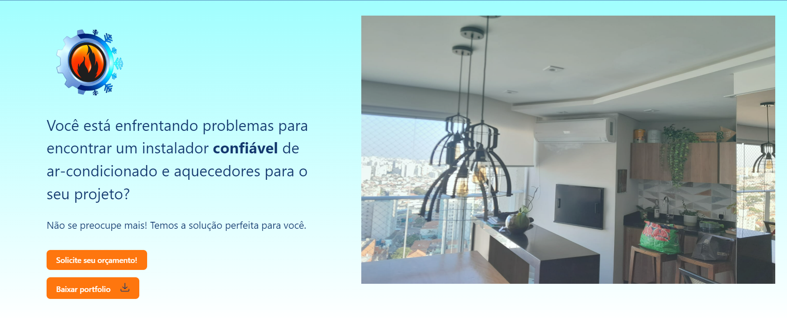

# LS Climatização e Refrigeração - Portfólio


## Descrição

Este é o site de portfólio da empresa LS Climatização e Refrigeração. O projeto foi desenvolvido em React com Vite, TypeScript e SCSS.

## Pré-requisitos

Antes de executar o projeto, verifique se você possui os seguintes requisitos instalados em seu ambiente de desenvolvimento:

- Node.js: [https://nodejs.org/](https://nodejs.org/)
- npm (geralmente vem junto com o Node.js)

## Instalação

Siga estas etapas para configurar o projeto em seu ambiente local:

1. Faça o clone deste repositório para o seu ambiente de desenvolvimento.

2. Abra o terminal na pasta raiz do projeto.

3. Execute o seguinte comando para instalar as dependências:

   ```shell
   npm install

## Uso

Para executar o projeto em seu ambiente de desenvolvimento, siga as etapas abaixo:

1. Certifique-se de estar na pasta raiz do projeto no terminal.

2. Execute o seguinte comando para iniciar o servidor de desenvolvimento:

   ```shell
   npm run dev
   
3. O servidor de desenvolvimento do Vite será iniciado e o site será aberto automaticamente no seu navegador padrão.

4. Agora você pode explorar o site de portfólio da LS Climatização e Refrigeração.

## Captura de tela


## Desenvolvido por:
Wendell Maschette

2023

